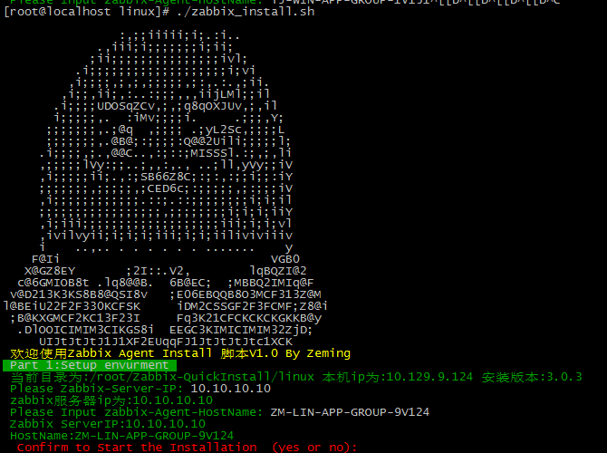

# Zabbix-QuickInstall


Zabbix 快速安装文档
请使用自动注册-匹配名称注册
#linux 一键安装
* 运行zabbix_install.sh 一键安装脚本两种运行方法
1. ./zabbix_install.sh 参数Zabbix服务器IP 参数注册Agent名称
2. ./zabbix_install.sh 运行

```
############# Linx&Centos发行版 CMD ##############
curl -O https://raw.githubusercontent.com/net592/Zabbix-QuickInstall/gh-pages/linux/zabbix_install.sh;
chmod 744 zabbix_install.sh;
./zabbix_install.sh
############# AWS亚马逊&Linux CMD ##############
curl -O https://raw.githubusercontent.com/net592/Zabbix-QuickInstall/gh-pages/linux/zabbix_install.sh;
chmod 744 zabbix_aws_install.sh;
./zabbix_aws_install.sh
#机器名称会追加获取EC2机器信息： InputAgentName-local-ipv4-instance-id
############################################
```

#Windows 一键安装
* 点击安装根据提示操作（根据需要修改服务器IP和部署安装文件路径和共享）

1. install_zabbix_3.0.bat  安装脚本
2. unstall_zabbix_3.0.bat  卸载脚本
